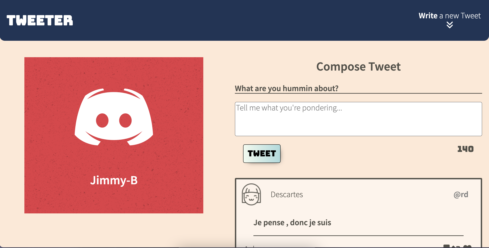
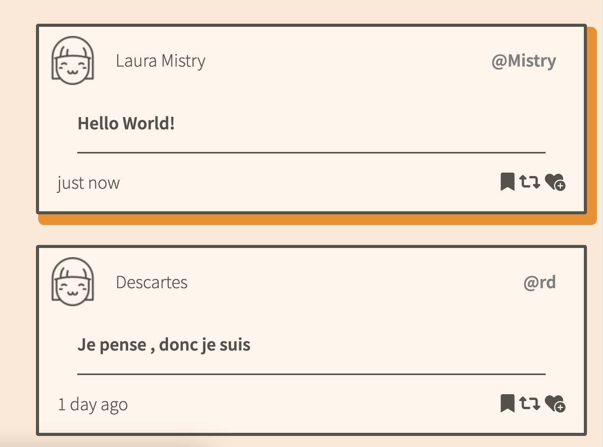

# Tweeter Project

Tweeter is a simple, single-page AJAX-based Twitter clone. Made using jQuery, HTML5 and good ol' CSS3

## Screenshots

- Main page screenshot 
- Tweets screenshot 

## Getting Started

1. [Create](https://docs.github.com/en/repositories/creating-and-managing-repositories/creating-a-repository-from-a-template) a new repository using this repository as a template.
2. Clone your repository onto your local device.
3. Install dependencies using the `npm install` command.
4. Start the web server using the `npm start` command. The app will be served at <http://localhost:8080/>.
5. Go to <http://localhost:8080/> in your browser.

## Dependencies

- Express
- Node 5.10.x or above

## Added extras

- Click on the write new tweet area to show/hide the compose tweet section
